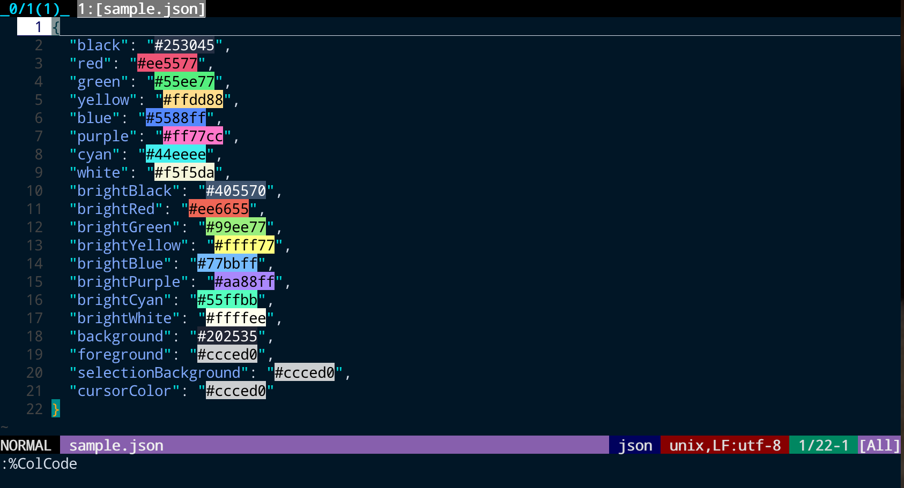

# hicolcode.vim

Vim plugin that highlight color codes in lines.



## Requirements

## Installation

If you use dein,
```vim
call dein#add('MeF0504/hicolcode.vim')
```
or do something like this.

## Usage

```vim
:ColCode
```
search for and highlight color codes in current line.  
The color code this plugin highlight is `#[0-9a-f][0-9a-f][0-9a-f][0-9a-f][0-9a-f][0-9a-f],
e.g. `#7d8fa4`, `#a47996`, `#00af5d`.

```vim
:ColCodeDisable
```
clear all highlights set by this plugin.

`ColCode` command can specify the line number range.
If you want to highlight lines from 2 to 10, you can do this by
```vim
:2,10ColCode
```
or, if you want to highlight all lines in the current file, the following command is possible.
```vim
:%ColCode
```

